# Commit Pro 
**Author: Ali Vaziri**  
**Role: Frontend Developer, Capstone Spring 2025, Stevens Institute of Technology**

## Introduction

As part of my senior capstone project, I contributed to **Commit Pro**, a team-based software engineering initiative designed to enhance commit documentation and repository analysis on GitHub. Commit Pro is a Chrome extension integrated with GitHub that provides **AI-generated commit summaries**, **refactoring detection**, and a **visual dashboard** displaying key repository metrics.

Our goal was to streamline development workflows by embedding intelligent, actionable insights directly within the GitHub experience. This blog summarizes the purpose of the project, our technical design, my specific contributions (focused on frontend engineering), and key lessons learned.

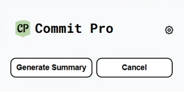
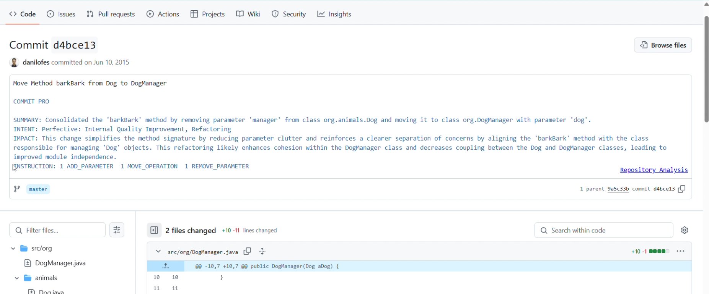

## Project Overview

Commit Pro addresses the long-standing issue of poor commit message quality in software development. Our solution automatically generates commit summaries using Large Language Models (LLMs), identifies refactorings using the RefactoringMiner API, and displays repository metrics (e.g., Lines of Code, Cyclomatic Complexity) via an interactive dashboard. All features are available through a GitHub-integrated Chrome extension.

### Key Features

- **AI-Generated Commit Summaries** using GPT-based models  
- **Refactoring Detection** integrated from RefactoringMiner  
- **React-based Dashboard** for displaying code quality metrics  
- **Secure Token Management** and API interactions with GitHub and LLM providers  

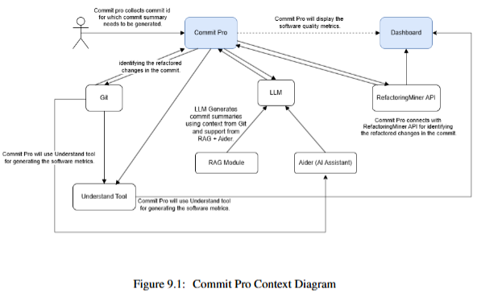

## Literature Review

We reviewed tools like CodeScene, GitHub Copilot, and Sourcetrail. However, these either focused on code generation or existed outside developers’ daily workflows. Commit Pro fills the gap by integrating summarization and metrics **inside** GitHub, based on literature around LLM-based code change summarization and neural summarizers.

## My Role: Frontend Developer

I was primarily responsible for building the React dashboard inside the Chrome extension. I developed dynamic charts, integrated backend APIs, and ensured consistent styling and responsiveness. I also helped troubleshoot extension-specific issues and contributed to the final documentation and presentation.

---

## Sprint 1: Setup and Routing

- Set up the Chrome extension structure and linked the React dashboard inside.
- Defined API contracts with the backend team.
- Created routing using `react-router-dom` and dummy chart placeholders.

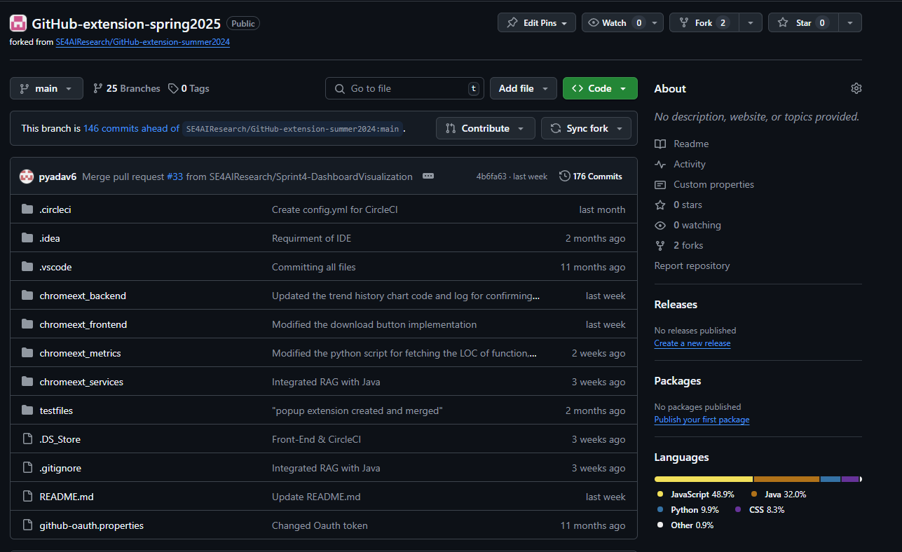

## Sprint 2: Component Development

- Built modular chart components for LOC, CC, and CBO using mock data.
- Created reusable tab UI layout and integrated dummy filtering mechanisms.

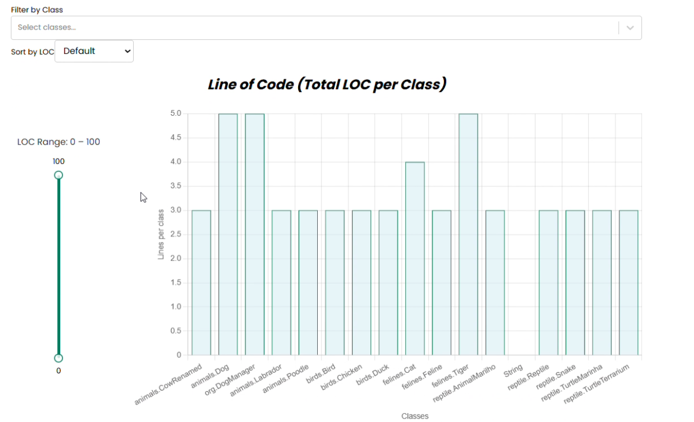

## Sprint 3: Backend Integration & UI Polish

- Integrated backend APIs using Axios.
- Fetched real metrics and replaced dummy datasets with live data.
- Added dropdowns, sliders, and `TrendHistoryChart` with consistent logic.
- Handled edge cases with missing values and added loading UIs.

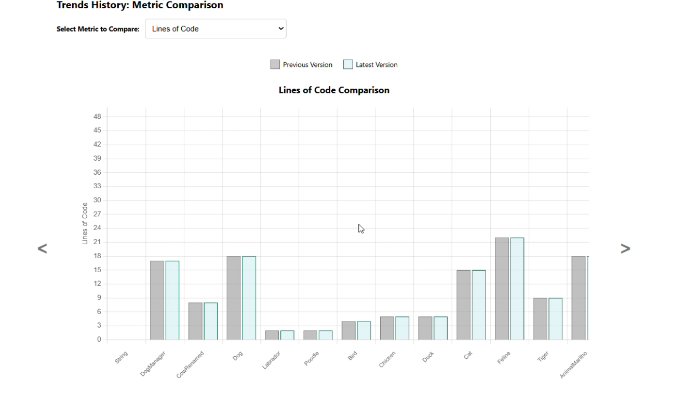

## Sprint 4: Final Polish, Dynamic Integration & Presentation Prep

- Final UI polish and cross-browser testing.
- Helped finalize Overleaf sections and created visuals for the showcase.
- Waited for the backend to provide **Understand tool output**.
- Once received, dynamically connected the dashboard to real output files.
- Removed hardcoded samples and converted the entire dashboard to **live, backend-powered data**.

<!-- ---

## Dashboard Preview

Example of embedded dashboard inside GitHub:

--- -->

## Agile Process & Team Coordination

We used **Agile Scrum** with Jira boards and weekly standups. Although I focused on front-end, I collaborated frequently with backend and extension developers. Overleaf was used for shared documentation, and GitHub was used for branching, reviews, and pull requests.

<!--  -->

---

## Key UI Features

### Tab Navigation  
Allows navigation between code metrics  
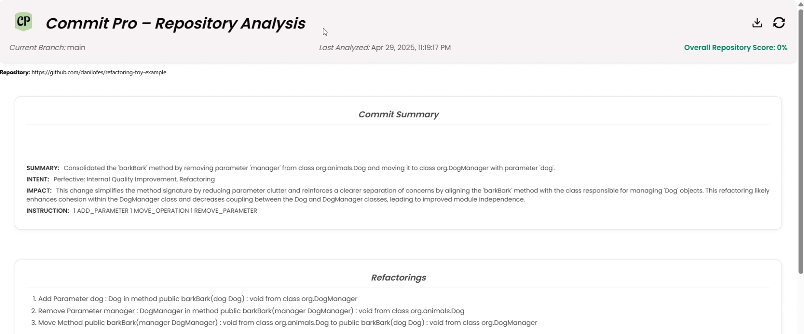
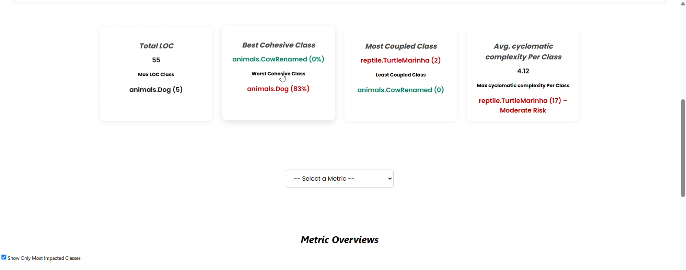
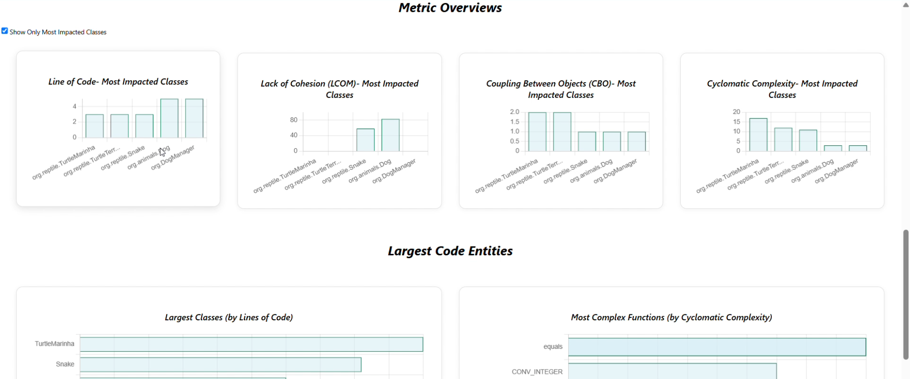
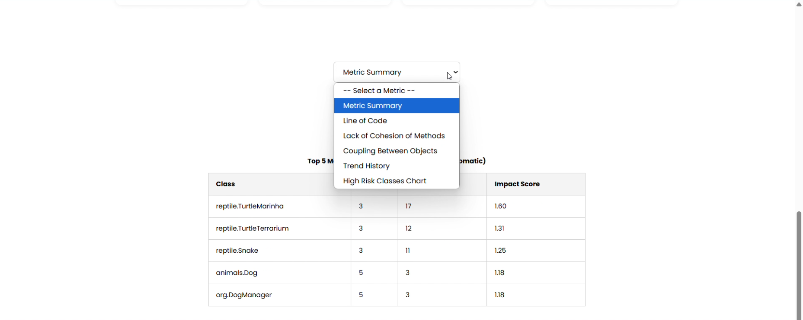

### Coupling Chart View  
Compares cohesion and coupling by class or commit  
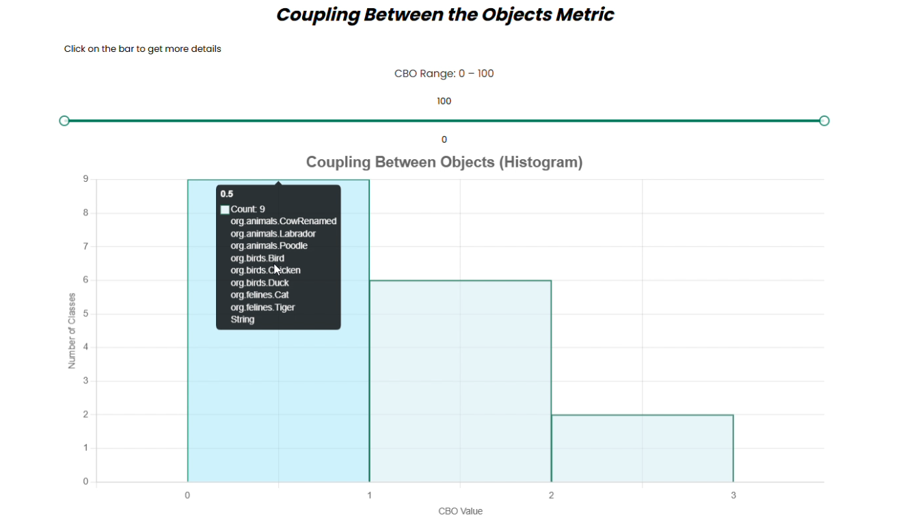

---

## Challenges

1. **React Routing in Chrome Extension**  
   ➤ Fixed using HashRouter and manifest changes.

2. **Asynchronous Data Fetching**  
   ➤ Used loading states and conditional renders.

3. **Inconsistent API Responses**  
   ➤ Coordinated schema updates and fallback logic.

4. **Style Collisions in Extension vs. Dashboard**  
   ➤ Scoped CSS modules and tested layout isolation.

---

## Lessons Learned

- Importance of **API contract planning**
- React’s **state management** best practices
- Cross-component communication and **reusability**
- **Chrome Extension quirks** and embedding React
- Real-world **team coordination** and collaborative debugging

---

## Conclusion & Next Steps

Commit Pro evolved from a simple prototype into a functional Chrome extension with powerful backend support. My focus on front-end engineering helped bring visual clarity and dynamic analysis to the tool.

**Future improvements** could include:
- Model switching and summary editing feedback
- Heatmap-style refactoring visualizations
- Better onboarding UX
- Chrome Web Store release and GitHub open-source repo

This project prepared me well for full-stack engineering roles and showed the value of blending AI, software metrics, and UI into a unified developer tool.

---

*Submitted by Ali Vaziri – Capstone Spring 2025*
